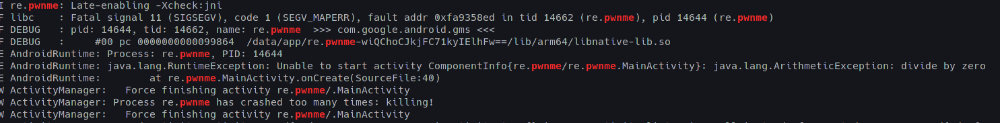

https://www.romainthomas.fr/post/20-09-r2con-obfuscated-whitebox-part1/#fn:1


## Tools

- jadx
- Visual Studio Code
- Frida
- radare2
- Genymotion, with Google Pixel 3a

## Intento

The application first check for some anti-root and anti-debug techniques.

```java
C0282 rb = new C0282(getApplicationContext()); // Class with anti-root, anti-debug techniques
if (rb.m1260() || (rb.m1253() && rb.m1248())) {
            int i = 1337 / 0;
            this.f508 = (byte) (this.f508 | 15);
}
m331();
```

#### Summary of techniques: 

For the first method rb.m1260() this are the methods used:

- Check for root applications:

```java
public boolean m1251(String[] additionalRootManagementApps) {
        ArrayList<String> packages = new ArrayList<>(Arrays.asList(C0272.f1009));
        if (additionalRootManagementApps != null && additionalRootManagementApps.length > 0) {
            packages.addAll(Arrays.asList(additionalRootManagementApps));
        }
        return m1255(packages);
    }
```

The C0272.f1009 variable have the root aplications that checks for:

```java
    public static final String[] f1009 = {"com.noshufou.android.su", "com.noshufou.android.su.elite", "eu.chainfire.supersu", "com.koushikdutta.superuser", "com.thirdparty.superuser", "com.yellowes.su", "com.topjohnwu.magisk", "com.kingroot.kinguser", "com.kingo.root", "com.smedialink.oneclickroot", "com.zhiqupk.root.global", "com.alephzain.framaroot"};

```

- Check for some installed applications: 

```java
public boolean m1256(String[] additionalDangerousApps) {
        ArrayList<String> packages = new ArrayList<>();
        packages.addAll(Arrays.asList(C0272.f1008));
        if (additionalDangerousApps != null && additionalDangerousApps.length > 0) {
            packages.addAll(Arrays.asList(additionalDangerousApps));
        }
        return m1255(packages);
    }
```

The C0272.f1008 variable have the applications that seems dangerous: 

```java
    public static final String[] f1008 = {"com.koushikdutta.rommanager", "com.koushikdutta.rommanager.license", "com.dimonvideo.luckypatcher", "com.chelpus.lackypatch", "com.ramdroid.appquarantine", "com.ramdroid.appquarantinepro", "com.android.vending.billing.InAppBillingService.COIN", "com.chelpus.luckypatcher"};

```

- Check for the "su" binary.

  ```java
  public boolean m1254(String filename) {
          String[] pathsArray = C0272.m1233();
          boolean result = false;
          for (String path : pathsArray) {
              String completePath = path + filename;
              if (new File(path, filename).exists()) {
                  C0288.m1278(completePath + " binary detected!");
                  result = true;
              }
          }
          return result;
      }
  ```

- Check for the some properties debuggeables: 

  ```java
  public boolean m1250() {
          Map<String, String> dangerousProps = new HashMap<>();
          dangerousProps.put("ro.debuggable", "1");
          dangerousProps.put("ro.secure", "0");
          boolean result = false;
          String[] lines = m1252();
          if (lines == null) {
              return false;
          }
          for (String line : lines) {
              for (String key : dangerousProps.keySet()) {
                  if (line.contains(key)) {
                      String badValue = "[" + dangerousProps.get(key) + "]";
                      if (line.contains(badValue)) {
                          C0288.m1278(key + " = " + badValue + " detected!");
                          result = true;
                      }
                  }
              }
          }
          return result;
      }
  ```

- ?

  ```java
  public boolean m1247() {
          String[] lines;
          String[] lines2;
          String[] lines3 = m1257();
          if (lines3 == null) {
              return false;
          }
          int length = lines3.length;
          boolean result = false;filename
          int i = 0;
          while (i < length) {
              String line = lines3[i];
              String[] args = line.split(" ");
              if (args.length < 4) {
                  C0288.m1282("Error formatting mount line: " + line);
                  lines = lines3;
              } else {
                  String mountPoint = args[1];
                  String mountOptions = args[3];
                  String[] strArr = C0272.f1006;
                  int length2 = strArr.length;
                  boolean result2 = result;
                  int i2 = 0;
                  while (i2 < length2) {
                      String pathToCheck = strArr[i2];
                      if (mountPoint.equalsIgnoreCase(pathToCheck)) {
                          String[] split = mountOptions.split(",");
                          int length3 = split.length;
                          int i3 = 0;
                          while (true) {
                              if (i3 >= length3) {
                                  lines2 = lines3;
                                  break;
                              }
                              lines2 = lines3;
                              if (split[i3].equalsIgnoreCase("rw")) {
                                  C0288.m1278(pathToCheck + " path is mounted with rw permissions! " + line);
                                  result2 = true;
                                  break;
                              }
                              i3++;
                              lines3 = lines2;
                          }
                      } else {
                          lines2 = lines3;
                      }
                      i2++;
                      lines3 = lines2;
                  }
                  lines = lines3;
                  result = result2;
              }
              i++;
              lines3 = lines;
          }
          return result;
      }		
  ```

- Check for the test-keys certificate: 

  ```java
  public boolean m1259() {
          String buildTags = Build.TAGS;
          return buildTags != null && buildTags.contains("test-keys");
      }
  ```

- Check for su process running: 

  ```java
  public boolean m1246() {
          Process process = null;
          boolean z = false;
          try {
              process = Runtime.getRuntime().exec(new String[]{"which", "su"});
              if (new BufferedReader(new InputStreamReader(process.getInputStream())).readLine() != null) {
                  z = true;
              }
              process.destroy();
              return z;
          } catch (Throwable th) {
              if (process != null) {
                  process.destroy();
              }
              return false;
          }
      }
  ```

- Using RootBeerNative to check for root: 

  ```java
  public boolean m1248() {
          if (!m1253()) {
              C0288.m1282("We could not load the native library to test for root");
              return false;
          }
          String[] paths = C0272.m1233();
          String[] checkPaths = new String[paths.length];
          for (int i = 0; i < checkPaths.length; i++) {
              checkPaths[i] = paths[i] + "su";
          }
          RootBeerNative rootBeerNative = new RootBeerNative();
          try {
              rootBeerNative.setLogDebugMessages(this.f1027);
              if (rootBeerNative.checkForRoot(checkPaths) > 0) {
                  return true;
              }
              return false;
          } catch (UnsatisfiedLinkError e) {
              return false;
          }
      }
  ```

- Check for magisk: 

  ```java
  public boolean m1249() {
          return m1254("magisk");
      }
  
  /* renamed from: θ  reason: contains not printable characters */
  public boolean m1254(String filename) {
      String[] pathsArray = C0272.m1233();
      boolean result = false;
      for (String path : pathsArray) {
          String completePath = path + filename;
          if (new File(path, filename).exists()) {
              C0288.m1278(completePath + " binary detected!");
              result = true;
          }
      }
      return result;
  }
  
  // On the class C0722
  
  public static final String[] f1007 = {"/data/local/", "/data/local/bin/", "/data/local/xbin/", "/sbin/", "/su/bin/", "/system/bin/", "/system/bin/.ext/", "/system/bin/failsafe/", "/system/sd/xbin/", "/system/usr/we-need-root/", "/system/xbin/", "/cache/", "/data/", "/dev/"};
  
  public static String[] m1233() {
      ArrayList<String> paths = new ArrayList<>(Arrays.asList(f1007));
      String sysPaths = System.getenv("PATH");
      if (sysPaths == null || "".equals(sysPaths)) {
          return (String[]) paths.toArray(new String[0]);
      }
      String[] split = sysPaths.split(":");
      int length = split.length;
      for (int i = 0; i < length; i++) {
          String path = split[i];
          if (!path.endsWith("/")) {
              path = path + '/';
          }
          if (!paths.contains(path)) {
              paths.add(path);
          }
      }
      return (String[]) paths.toArray(new String[0]);
  }
  
  
  
  ```

For the second rb.m1253() and third rb.m1248() function:

- Checks for RootBeerNative():

```java
public boolean m1253() {
        return new RootBeerNative().m321();
    }
```

- Loads the RootBinaryNative to use the method checkForRoot()

```java
public boolean m1248() {
        if (!m1253()) {
            C0288.m1282("We could not load the native library to test for root");
            return false;
        }
        String[] paths = C0272.m1233();
        String[] checkPaths = new String[paths.length];
        for (int i = 0; i < checkPaths.length; i++) {
            checkPaths[i] = paths[i] + "su";
        }
        RootBeerNative rootBeerNative = new RootBeerNative();
        try {
            rootBeerNative.setLogDebugMessages(this.f1027);
            if (rootBeerNative.checkForRoot(checkPaths) > 0) {
                return true;
            }
            return false;
        } catch (UnsatisfiedLinkError e) {
            return false;
        }
    }
```

The class RootBeerNative loads the tool-checker library: 

```java
public class RootBeerNative {

    /* renamed from: θ  reason: contains not printable characters */
    public static boolean f506;

    public native int checkForRoot(Object[] objArr);

    public native int setLogDebugMessages(boolean z);

    static {
        f506 = false;
        try {
            System.loadLibrary("tool-checker");
            f506 = true;
        } catch (UnsatisfiedLinkError e) {
            C0288.m1282(e);
        }
    }

    /* renamed from: θ  reason: contains not printable characters */
    public boolean m321() {
        return f506;
    }
}
```

If this checks dont complete it will create a button to "pay":

```java
public final void m331() {
        Button pay = (Button) findViewById(2131165279);
        pay.setOnClickListener(new View$OnClickListenerC0064(pay));
    }
```

The onClick function:

```java
public void onClick(View v) {
    if (this.f510 != null) {
        TextView r2coin_token = (TextView) MainActivity.this.findViewById(2131165285);
        if (MainActivity.this.m330()) {
            try {
                if (MainActivity.this.f509.length() != 4) {
                    Toast.makeText(MainActivity.this.getApplicationContext(), "PIN code must be 4 digits long...", 0).show();
                    return;
                }
                MainActivity.this.f509 = String.format("%08d", Integer.valueOf(Integer.parseInt(MainActivity.this.f509)));
                if (MainActivity.this.f507.length() <= 8) {
                    MainActivity.this.f507 = String.format("%08d", Integer.valueOf(Integer.parseInt(MainActivity.this.f507)));
                    byte[] inBuff = (MainActivity.this.f509 + MainActivity.this.f507).getBytes();
                    C0282 rb = new C0282(MainActivity.this.getApplicationContext());
                    if (rb.m1260() || (rb.m1253() && rb.m1248())) {
                        MainActivity mainActivity = MainActivity.this;
                        mainActivity.f508 = (byte) (mainActivity.f508 | 15);
                        new NullPointerException().notify();
                    }
                    Toast.makeText(MainActivity.this.getApplicationContext(), "Tokenizing your r2coin...", 0).show();
                    MainActivity mainActivity2 = MainActivity.this;
                    byte[] out = mainActivity2.gXftm3iswpkVgBNDUp(inBuff, mainActivity2.f508);
                    if (out[0] == 81) {
                        r2coin_token.setTextColor(-65536);
                    } else {
                        r2coin_token.setTextColor(Color.parseColor("#10b010"));
                    }
                    r2coin_token.setText("r2c-" + MainActivity.m328(out, 1));
                    return;
                }
                Toast.makeText(MainActivity.this.getApplicationContext(), "Enormous amount to tokenize r2coins.\nRadare2 is a non-profit organization :)", 0).show();
            } catch (Exception e) {
                Toast.makeText(MainActivity.this.getApplicationContext(), "Enter PIN code/amount as numeric...", 0).show();
            }
        } else {
            String empty = String.format("%032d", 0);
            r2coin_token.setTextColor(-65536);
            r2coin_token.setText("r2c-" + empty);
        }
    }
}
```

In my device, we can see the Arithmetic error when the root/frida is detected:



From this part of code at onCreate() method:

```java
int i = 1337 / 0;
```