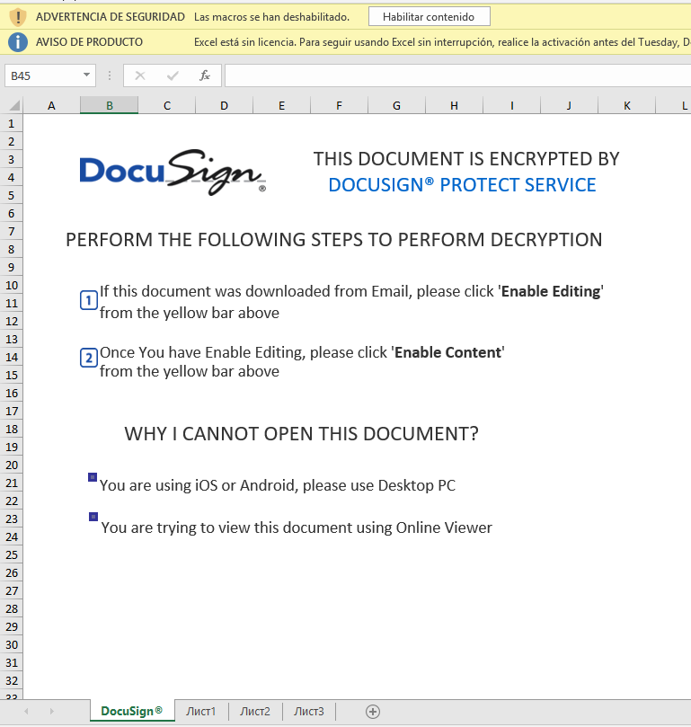
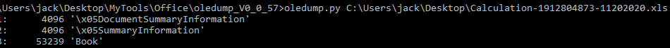
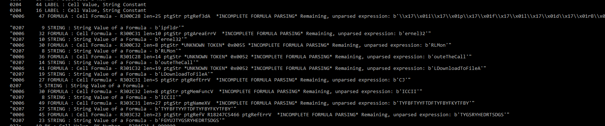
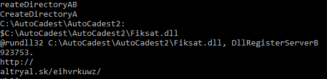
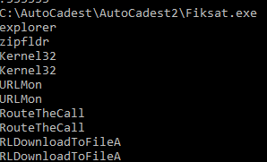

## 

We got a malicious XLS

Try to trick us to enable the content to execute the payload, but there is no VBA code.

But with the option -p pluign_biff we can see there is some interesting code at the cells from the excell.

Kernel32, URLMon, DownloadToFileA probably is downloading a file and doing something with him, because i see that byte string i like to pass it floss tool.

There we see mote interesting strings:

- C:\Autocadest\AutoCadest2\fiksat.dll
- rundll32 C:\Autocadest\AutoCadest2\fiksat.dll, DllRegisterServerB
- C:\Autocadest\AutoCadest2\fiksat.exe
- hxxp://altryal.sk/eihvrkuwz/923753.jpg <- i complete the jpg using the HxD tool at the workbook stream (unzip the xls).

So in order to download the malware executable the excel have some cells hidden were the payload resides, to get thj

e